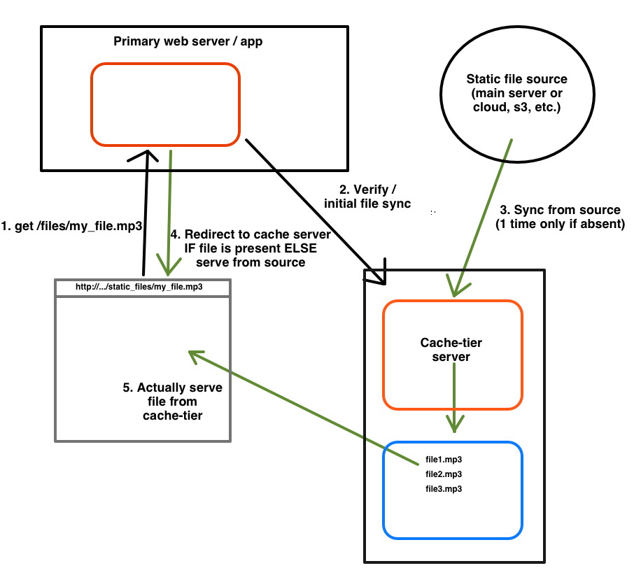

# Cache Tier Web Application

## Overview

Imagine you have a set of static files you want to serve to the world. Cache-tier allows you to quickly spin up a Linux web server in a location with cheap, plentiful bandwidth and serve those files to your users.

## Architecture

The way it works is you direct users to a view a file on your primary site which actually maps to a Python view (e.g. `site.com/files/my_file.mp3` where `files` is the view method). This view coordinates with the cache-tier to either trigger the sync of or detect a static file (e.g. mp3, video, etc). Once synced, the main server will direct all traffic to the cache-tier rather than the file source.

Here is a rough sketch of the flow:

The original use-case for this project was MP3s from the [Talk Python To Me podcast](http://talkpythontome.com). These files are available on Amazon S3 but the costs for bandwidth on S3 were much higher than other options. Hence, hosting the cache-tier server elsewhere and using cache-tier to serve terabytes of data per month was much more cost effective and just as fast as S3.

As of this writing, you can visit [talkpythontome.com](http://talkpythontome.com), click download mp3 for any episode and see the flow in action. During peak load (when new episodes were released), the cache-tier server a sustained 900 MBit/sec of MP3s for hundreds of requests without missing a beat.

## Setup

###Server:

You need to setup the web application for the cache-tier. This is a simple Flask Python 3 application. The recommended setup is NGinx-> uWSGI -> Flask. The server stores the static files locally on the hard drive. 

The server has several configuration settings such as where to store the files locally and where to look remotely for files when syncing.

**Important**: Make certain that you use NGnix, and not uWSGI/Flask, to serve the static files.

###Client:

Use the CacheTierClient for efficient results. It uses the REST/JSON API to determine if a cached file is available and to signal a sync if it isn't.

Typical code might look like this:

    import cache_tier_client
    
    def main():
        base_url = "http://downloads.yourserver.com/"
        file = 'some_big_file.mp3'
    
        while True:
            input("Enter to simulate request")
            cache = cache_tier_client.CacheTierClient(
                        base_url, local_cache_time=20)
                        
            if cache.verify_file(file):
                print("File validated, would download at:")
                print(cache.build_download_url(file))
            else:
                print("File NOT validated")
                print("Serve directly from source")
            print()

